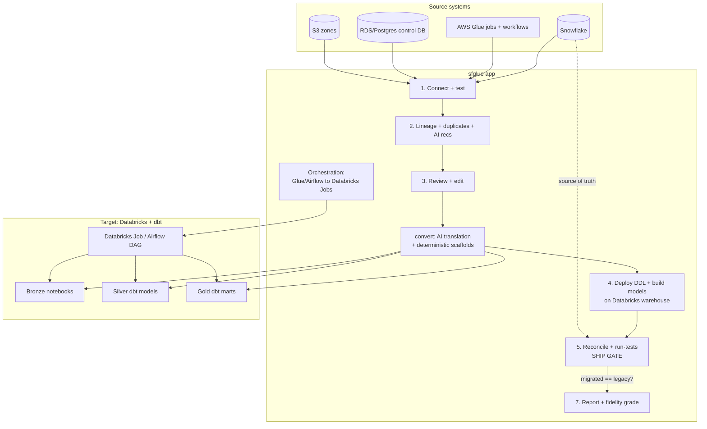

# sfglue — Architecture Map

*What this app is trying to do, mapped end-to-end from the actual code.*

## The one-line goal

**sfglue migrates an existing AWS data pipeline — a Snowflake + AWS Glue + RDS-control-DB "commercial data lake" — onto Databricks + dbt, and proves the result matches the original before anything ships.**

It is a self-contained Flask + vanilla-JS web app (split out of a larger "BI Migration Tool"). A user connects their source systems, the app reads them, uses AI to translate the logic, deploys to Databricks, and then runs a hard reconciliation gate (migrated table must equal the legacy Snowflake table) before calling the migration done.

---

## Two halves of the repo

| Half | Path | Role |
|---|---|---|
| The migration **tool** | `backend/`, `frontend/`, `qvd_to_databricks/`, `server.py` | The actual app the user runs |
| The migration **subject** | `reference_cdl/` | A real, deployable demo of the *source* pipeline (the "CDL" Glue/S3/Postgres/Snowflake + Airflow environment) plus its already-migrated Databricks twin. This is what the tool migrates *from* — a live reference environment, not a test fixture. |

`qvd_to_databricks/` is a leftover QVD-file toolkit; the sfglue backend uses **only two things** from it — `DatabricksConnectionConfig` and `execute_sql_statement` — as its Databricks REST/SQL client. The rest of that package (QVD readers, profilers, parquet converters) is legacy and unused by this flow.

---

## The pipeline being migrated (source → target)

**Source (reference_cdl):** a 7-job Glue chain, orchestrated by a Glue Workflow (`cdl_ingest`) or an Airflow DAG, audited by an RDS/Postgres control DB:

```
SFTP landing → S3 zones (landing → raw → curated → publish) → Snowflake
   load_config → parent_batch_open → landing_to_raw → raw_to_curated
   → curated_to_publish → publish_to_snowflake → parent_batch_close
```

**Target (what sfglue produces):** medallion architecture on Databricks + dbt:

```
source data → BRONZE (Databricks notebooks / Auto Loader)
            → SILVER (dbt staging + intermediate models)
            → GOLD  (dbt marts: dim_*/fct_*)  → consumers
   orchestrated by a Databricks Job (or emitted Airflow DAG)
```

The "split" happens at the bronze boundary: **ingestion** Glue jobs become Databricks bronze notebooks (Extract+Load); **transformation** jobs and Snowflake views become dbt models (Transform).

---

## The 7-step user wizard (frontend flow)

The SPA is a hash-routed wizard. Each step unlocks the next via route guards on the store state.

| # | Page | What the user does | Backend calls |
|---|---|---|---|
| — | `sfglue-home` | Landing / resume | none |
| 1 | `sfglue-connect` | Test Snowflake + Glue (+ optional Postgres control DB); AWS SSO device login; list S3 buckets | `snowflake/test-connection`, `snowflake/schemas`, `glue/test-connection`, `postgres/test-connection`, `aws/sso/*`, `aws/buckets` |
| 2 | `sfglue-lineage` | Build source→Snowflake dataflow graph; flag duplicate tables + get AI consolidation recommendations; view "ops flow" | `sfglue/lineage`, `sfglue/lineage/operational` |
| 3 | `sfglue-review` | Pick tables to migrate; view/edit source (Glue + SQL) beside generated output; run the conversion | `sfglue/review`, `sfglue/convert` |
| 4 | `sfglue-databricks-agent` | Configure Databricks destination; precheck vs Unity Catalog; deploy table DDL; run bronze load; seed sample data | `sfglue/precheck`, `sfglue/deploy`, `sfglue/build`, `sfglue/seed-bronze`, `sfglue/databricks/test-connection` |
| 5 | `sfglue-dbt-agent` | **Ship gate:** review models/tests, run local dbt-Core, reconcile vs Snowflake, run tests, export runnable dbt project | `dbt-local/*`, `sfglue/reconcile`, `sfglue/run-tests`, `sfglue/export` |
| 6 | `sfglue-map` | View source→target artifact map (pure render) | none |
| 7 | `sfglue-report` | Scorecard + AI fidelity grade + Markdown export | `sfglue/grade`, `sfglue/explain` |

**Express path — `sfglue-run`:** one-click automation that chains lineage → review → convert → *[review checkpoint]* → precheck → build → reconcile, plus optional workflow/Airflow orchestration deploy + workspace push + job dry-run. Writes to the same store keys the manual pages read.

---

## Backend route map (Flask blueprints)

All under `backend/integrations/routes/`. Registered via `register_snowflake_glue_routes(app, call_ai)`.

**connections.py** — `POST /api/sfglue/{snowflake,glue,postgres,databricks}/test-connection`, `snowflake/schemas`, `aws/buckets`
**sso.py** — `POST /api/aws/sso/{start,poll,accounts,credentials}` (device-flow "Sign in with AWS")
**lineage.py** — `POST /api/sfglue/lineage`, `lineage/operational`
**review.py** — `POST /api/sfglue/{review,explain,grade}` (AI read-only inspection)
**convert.py** — `POST /api/sfglue/{precheck,convert,export}` (the core generation step)
**deploy.py** — `POST /api/sfglue/{deploy,build,seed-bronze,reconcile,run-tests}` (execute on Databricks + verification gates)
**orchestration.py** — `POST /api/sfglue/workflows/{plan,deploy,run}`, `airflow/{plan,emit}`, `workspace/push`
**dbt_local.py** — `POST /api/dbt-local/run-sfglue`, `GET /api/dbt-local/status/<id>`, `POST /api/dbt-local/cancel/<id>`
Plus `GET /api/health` and the SPA static fallback in `app.py`.

---

## Backend engine by responsibility

**AI dispatch (the only code that talks to an LLM).** `call_ai.py` is the single entry point; provider clients are `bedrock_client.py` (default — Amazon Bedrock Converse, Sonnet for conversion), `anthropic_client.py`, `openai_client.py`, sharing `ai_client.py`. Every other module receives an injected `call_ai` and degrades to a deterministic scaffold when AI is unavailable. A ~1-token preflight probe refuses AI steps up front (`needsAiConfig`) rather than emit fake output.

**Source connectors (deterministic).** `snowflake_client.py` (tables/views/columns/DDL/FKs/pipeline objects), `glue_client.py` (catalog + jobs + workflows/triggers/crawlers + reads job scripts from S3), `postgres_client.py` (source tables + detects RDS control-framework tables by name/column fingerprint, masks secrets).

**Core conversion engine.** `snowflake_glue_migration.py` (2,572 lines) — `run_conversion` orchestrates: ingestion jobs → bronze notebooks, transformation jobs + views → dbt models, tables → Delta DDL + staging. `build_dbt_project_files` assembles a runnable dbt project; `build_precheck` diffs against existing Databricks tables; `grade_migration_fidelity`/`explain_artifact` are AI advisory; `build_bronze_seed_statements` makes demo seed data; `generate_postgres_bronze_ingestion` makes a JDBC landing notebook. `migration/dialect_normalizer.py` mechanically rewrites Snowflake SQL functions → Databricks after AI; `migration/duckdb_execution.py` optionally runs SQL on sample data for ground-truth validation.

**Lineage & analysis (deterministic + optional AI).** `snowflake_glue_lineage.py` — `build_lineage` (medallion graph), `parse_pyspark_io` (reads/writes from Glue scripts), `detect_duplicates` (same table across systems by column overlap), `recommend`/`explain_business_logic` (AI). `operational_lineage.py` fuses control-plane + Glue chain + catalog into one laned graph.

**Build / deploy / verify.** `dbt_build.py` — `compile_models` resolves `{{ ref }}`/`{{ source }}` into runnable `CREATE OR REPLACE`, topo-sorted; `attempt_build_with_repair` auto-fixes schema errors against real columns via AI. `dbt_local.py` runs real dbt-Core as a subprocess. `reconcile.py` — cross-engine fingerprint diff (row count + key integrity + per-column aggregates; can't JOIN across engines so it compares computed fingerprints) — **the hard ship gate**. `reconcile_suggest.py` suggests keys/excludes for non-technical operators. `sfglue_sql_guard.py` blocks anything but a single CREATE before executing AI-generated SQL on a live warehouse.

**Orchestration (deterministic — no AI, by design).** `orchestration_migration.py` converts Glue Workflows/Triggers → Databricks Jobs (JSON + DAB YAML) and deploys idempotently. `airflow_migration.py` AST-parses Airflow DAGs (and dag-factory YAML) into the same model, and `emit_target_airflow_yaml` emits a DAG that drives the *migrated* pipeline. `workspace_push.py` pushes notebooks + dbt project into the Databricks workspace and runs jobs.

**Gap-plan phases (control framework migration).** `control_plane_migration.py` (RDS control tables → Delta DDL + `query_configuration` SQL rows → dbt models + framework runtime notebooks), `dq_migration.py` (`dq_rules` → dbt tests + `__rejects` quarantine models + notification config), `governance_migration.py` (Lake Formation permissions → Unity Catalog GRANT script, diff-only), `consumption_inventory.py` (outbound cutover checklist + Snowflake pipeline-object dispositions).

**Export / packaging.** `bundle_export.py` builds a Databricks Asset Bundle (dev/test/prod). `snowflake_glue_migration.build_dbt_project_files` builds the plain dbt zip. `convert` also emits a versioned `artifact_registry`.

**Auth & utilities.** `aws_sso_auth.py` (SSO device flow — long-lived token stays server-side, only short-lived role creds reach the browser), `reference_cdl_tools.py` (in-app S3/Postgres reference-env ops), `databricks_agent_routes.py` (a shim exposing `introspect_schema_tables`).

---

## End-to-end data flow



---

## Design principles visible in the code

- **AI only where translation is needed; deterministic where correctness is safety-critical.** Schedules, DQ rules, and grants are never AI-generated (a wrong schedule = silent outage). Only code translation and advisory analysis use the LLM.
- **Nothing ships until it's proven.** The AI self-grade is explicitly labeled *triage only*; the real gate is: review queue empty AND reconciliation passes AND tests/contracts build.
- **Source-agnostic, no hardcoding.** Credentials are supplied per-request from the UI; roles/columns/edges are derived from live introspection and config evidence, not baked-in literals.
- **Graceful degradation.** Missing bronze grounding, unreachable providers, expired SSO tokens all produce actionable warnings instead of silent bad output.
